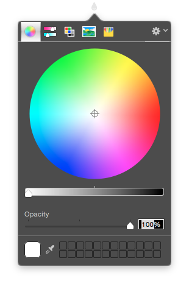

# Iro (色)

Tired of OSX color picker apps either totally sucking or costing money. This one is open source and _hopefully_ doesn't suck.

__[Download](https://github.com/ripeworks/iro/releases)__



## Features

* Displays native color picker (as well as custom color pickers).
* Copy current color HEX value to clipboard.
* No item in dock, yay!

## Color Pickers you should have

* [Bjango - Skala Color](http://download.bjango.com/skalacolor/)
* [Panic - Developer Color Picker](https://panic.com/~wade/picker/)

__Installing Color Pickers__

```bash
$ mv DeveloperColorPicker.colorPicker ~/Library/ColorPickers/DeveloperColorPicker.colorPicker
```

## Contributing

This was built to serve one purpose: make it super easy to pick a color from the screen and grab the HEX value. While I won't be adding more features myself, I will certainly be open to merging any pull requests!

## Credits

* [BFColorPickerPopover](https://github.com/DrummerB/BFColorPickerPopover) for displaying native color picker.
* [Batch](https://github.com/AdamWhitcroft/Batch) for droplet menu bar icon.
